# System Architecture Diagrams

This document provides visual representations of the MVP Reddit AI Agent architecture, showing data flows, component interactions, and key design patterns.

## Table of Contents
1. [High-Level System Overview](#high-level-system-overview)
2. [Agent Processing Pipeline](#agent-processing-pipeline)
3. [Data Flow: Reddit to Action](#data-flow-reddit-to-action)
4. [Belief Graph Structure](#belief-graph-structure)
5. [Dashboard Architecture](#dashboard-architecture)
6. [Deployment Architecture](#deployment-architecture)

---

## High-Level System Overview

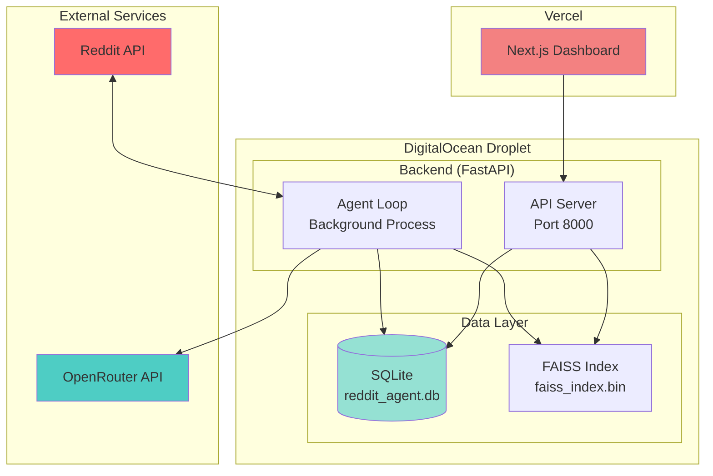
```mermaid
graph TB
    subgraph "External Services"
        Reddit[Reddit API]
        OpenRouter[OpenRouter API]
    end

    subgraph "DigitalOcean Droplet"
        subgraph "Backend (FastAPI)"
            API[API Server<br/>Port 8000]
            Agent[Agent Loop<br/>Background Process]
        end

        subgraph "Data Layer"
            SQLite[(SQLite<br/>reddit_agent.db)]
            FAISS[FAISS Index<br/>faiss_index.bin]
        end

        Agent --> SQLite
        Agent --> FAISS
        API --> SQLite
        API --> FAISS
    end

    subgraph "Vercel"
        Dashboard[Next.js Dashboard]
    end

    Reddit <--> Agent
    Agent --> OpenRouter
    Dashboard --> API

    style Reddit fill:#ff6b6b
    style OpenRouter fill:#4ecdc4
    style SQLite fill:#95e1d3
    style Dashboard fill:#f38181
```

### Component ResponsibilitiesThey could. Sick. 

| Component | Responsibility | Technology |
|-----------|---------------|------------|
| Agent Loop | Monitor Reddit, generate responses, update beliefs | Python asyncio |
| API Server | Serve dashboard, handle moderation actions | FastAPI |
| SQLite | Store beliefs, interactions, pending posts | SQLite + JSON1 |
| FAISS | Semantic search over past interactions | FAISS CPU |
| Dashboard | Monitor activity, moderate posts, edit beliefs | Next.js 14 |
| Reddit API | Read posts/comments, publish responses | asyncpraw |
| OpenRouter | LLM inference (GPT-5.1-mini, Claude-4.5-Haiku) | OpenAI SDK |

---

## Agent Processing Pipeline

The agent follows a six-stage pipeline for each interaction:

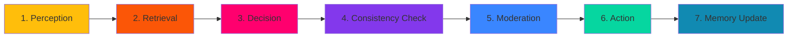
```mermaid
flowchart LR
    A[1. Perception] --> B[2. Retrieval]
    B --> C[3. Decision]
    C --> D[4. Consistency Check]
    D --> E[5. Moderation]
    E --> F[6. Action]
    F --> G[7. Memory Update]

    style A fill:#ffbe0b
    style B fill:#fb5607
    style C fill:#ff006e
    style D fill:#8338ec
    style E fill:#3a86ff
    style F fill:#06d6a0
    style G fill:#118ab2
```

### Stage Details

#### 1. Perception
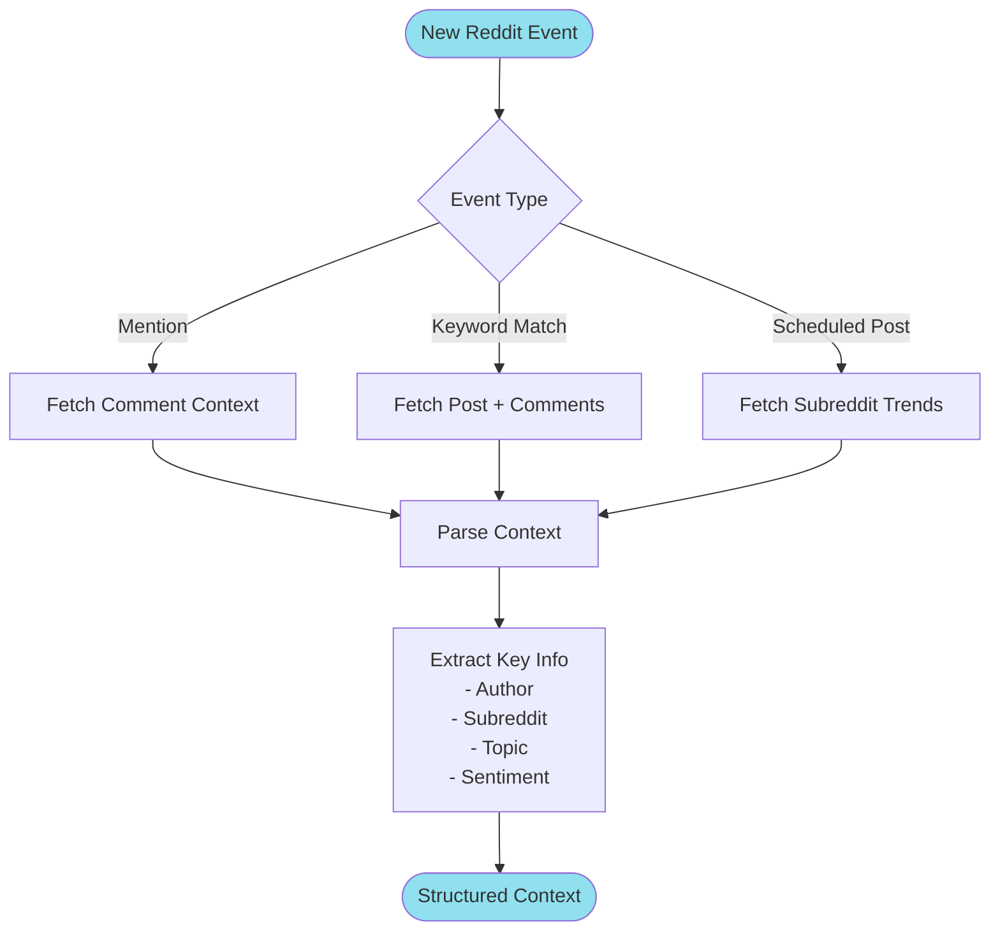
```mermaid
flowchart TD
    Start([New Reddit Event]) --> Type{Event Type}
    Type -->|Mention| Fetch1[Fetch Comment Context]
    Type -->|Keyword Match| Fetch2[Fetch Post + Comments]
    Type -->|Scheduled Post| Fetch3[Fetch Subreddit Trends]

    Fetch1 --> Parse[Parse Context]
    Fetch2 --> Parse
    Fetch3 --> Parse

    Parse --> Extract[Extract Key Info<br/>- Author<br/>- Subreddit<br/>- Topic<br/>- Sentiment]
    Extract --> Output([Structured Context])

    style Start fill:#90e0ef
    style Output fill:#90e0ef
```

**Inputs:** Reddit API event (mention, comment, scheduled trigger)
**Outputs:** Structured context object with author, subreddit, topic, sentiment
**Services:** `reddit_client.py`, `perception.py`

#### 2. Retrieval
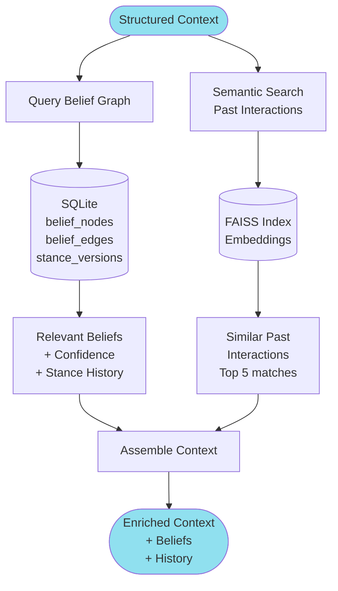
```mermaid
flowchart TD
    Context([Structured Context]) --> Query1[Query Belief Graph]
    Context --> Query2[Semantic Search<br/>Past Interactions]

    Query1 --> SQLite[(SQLite<br/>belief_nodes<br/>belief_edges<br/>stance_versions)]
    Query2 --> FAISS[(FAISS Index<br/>Embeddings)]

    SQLite --> Beliefs[Relevant Beliefs<br/>+ Confidence<br/>+ Stance History]
    FAISS --> History[Similar Past<br/>Interactions<br/>Top 5 matches]

    Beliefs --> Assemble[Assemble Context]
    History --> Assemble

    Assemble --> Output([Enriched Context<br/>+ Beliefs<br/>+ History])

    style Context fill:#90e0ef
    style Output fill:#90e0ef
```

**Logic:**
```python
# Belief retrieval
beliefs = await memory_store.query_beliefs(
    tags=context.topic_tags,
    min_confidence=0.5
)

# History retrieval (semantic search)
embedding = embedder.encode(context.text)
similar_ids = faiss_index.search(embedding, k=5)
history = await memory_store.get_interactions(similar_ids)
```

**Outputs:**
- 3-5 relevant beliefs (with current stance + confidence)
- 5 similar past interactions (for consistency)

#### 3. Decision
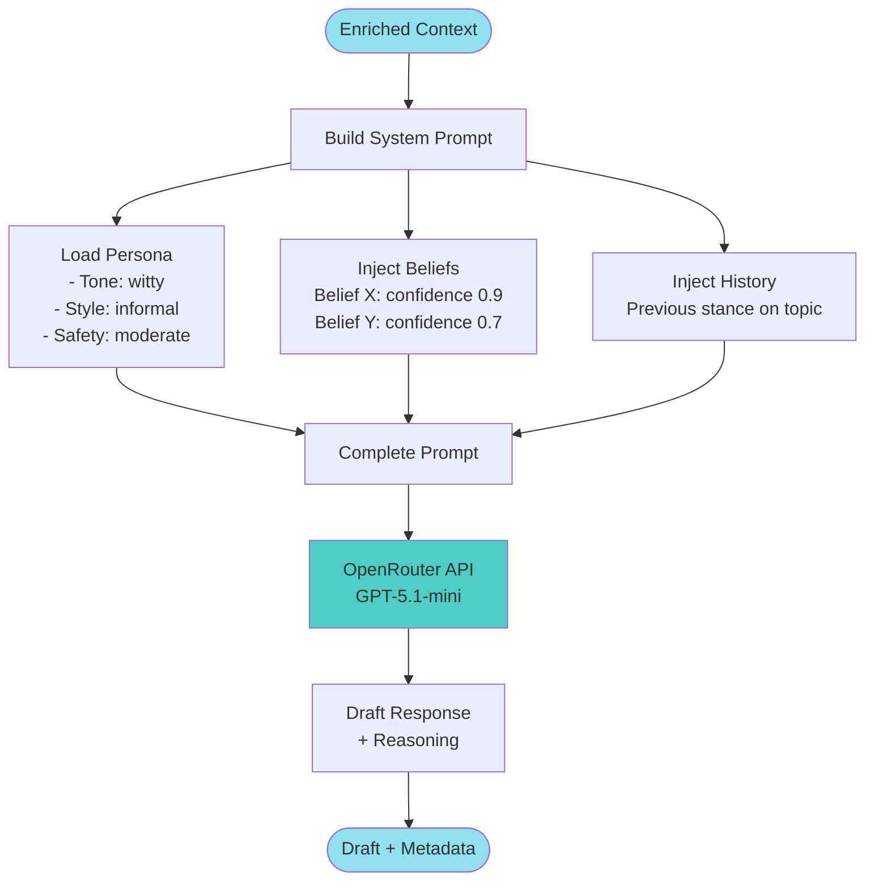
```mermaid
flowchart TD
    Enriched([Enriched Context]) --> Build[Build System Prompt]

    Build --> Persona[Load Persona<br/>- Tone: witty<br/>- Style: informal<br/>- Safety: moderate]
    Build --> Beliefs[Inject Beliefs<br/>Belief X: confidence 0.9<br/>Belief Y: confidence 0.7]
    Build --> History[Inject History<br/>Previous stance on topic]

    Persona --> Prompt[Complete Prompt]
    Beliefs --> Prompt
    History --> Prompt

    Prompt --> LLM[OpenRouter API<br/>GPT-5.1-mini]
    LLM --> Response[Draft Response<br/>+ Reasoning]

    Response --> Output([Draft + Metadata])

    style Enriched fill:#90e0ef
    style Output fill:#90e0ef
    style LLM fill:#4ecdc4
```

**System Prompt Template:**
```
You are a Reddit user with the following persona:
- Tone: {persona.tone}
- Core beliefs: {beliefs_summary}

Previous statements on this topic:
{history_summary}

Respond to the following Reddit {post/comment} while:
1. Staying consistent with your beliefs
2. Matching your established tone
3. Citing evidence when making claims

Context: {enriched_context}
```

**Outputs:** Draft response + reasoning + tokens used

#### 4. Consistency Check
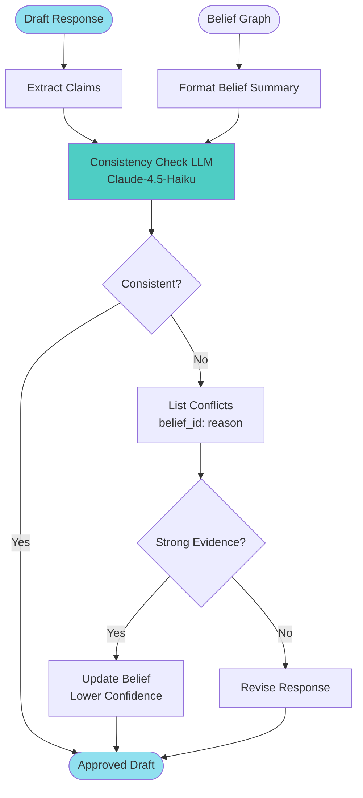
```mermaid
flowchart TD
    Draft([Draft Response]) --> Extract[Extract Claims]
    Beliefs([Belief Graph]) --> Format[Format Belief Summary]

    Extract --> Compare[Consistency Check LLM<br/>Claude-4.5-Haiku]
    Format --> Compare

    Compare --> Result{Consistent?}

    Result -->|Yes| Pass([Approved Draft])
    Result -->|No| Conflicts[List Conflicts<br/>belief_id: reason]

    Conflicts --> Decide{Strong Evidence?}
    Decide -->|Yes| Update[Update Belief<br/>Lower Confidence]
    Decide -->|No| Revise[Revise Response]

    Update --> Pass
    Revise --> Pass

    style Draft fill:#90e0ef
    style Pass fill:#90e0ef
    style Compare fill:#4ecdc4
```

**Consistency Check Prompt:**
```json
{
  "beliefs": [
    {"id": "B1", "text": "Climate change is real", "confidence": 0.95},
    {"id": "B2", "text": "EVs reduce emissions", "confidence": 0.8}
  ],
  "draft": "Electric cars are worse for the environment than gas cars.",
  "task": "Identify conflicts and assess evidence strength"
}
```

**Output:**
```json
{
  "is_consistent": false,
  "conflicts": [
    {"belief_id": "B2", "reason": "Contradicts stance on EV emissions"}
  ],
  "evidence_strength": "weak",
  "recommendation": "revise"
}
```

#### 5. Moderation
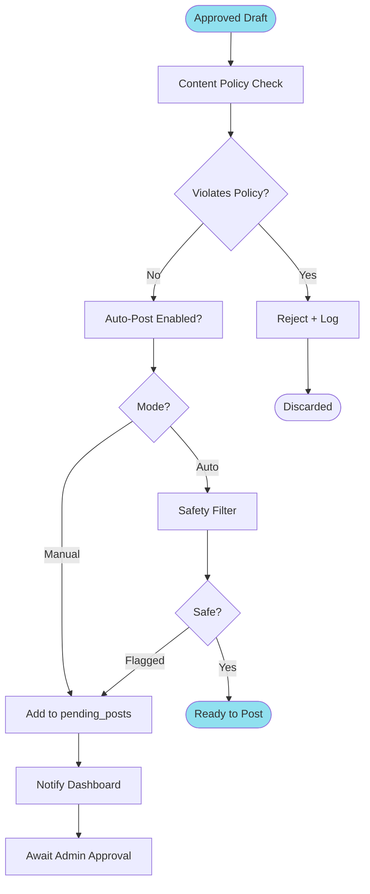
```mermaid
flowchart TD
    Approved([Approved Draft]) --> Check1[Content Policy Check]

    Check1 --> Policy{Violates Policy?}
    Policy -->|Yes| Reject[Reject + Log]
    Policy -->|No| Check2

    Check2[Auto-Post Enabled?] --> Auto{Mode?}
    Auto -->|Manual| Queue[Add to pending_posts]
    Auto -->|Auto| Safety

    Safety[Safety Filter] --> Safe{Safe?}
    Safe -->|Yes| Ready([Ready to Post])
    Safe -->|Flagged| Queue

    Queue --> Notify[Notify Dashboard]

    Reject --> End([Discarded])
    Notify --> Await[Await Admin Approval]

    style Approved fill:#90e0ef
    style Ready fill:#90e0ef
```

**Content Policy Checks:**
- No personal information (regex + LLM check)
- No hate speech (keyword filter + OpenRouter moderation endpoint)
- No spam patterns (rate limiting)
- No off-topic for target subreddit

**Queue Management:**
```sql
INSERT INTO pending_posts (persona_id, content, status)
VALUES (?, ?, 'pending');
```

#### 6. Action
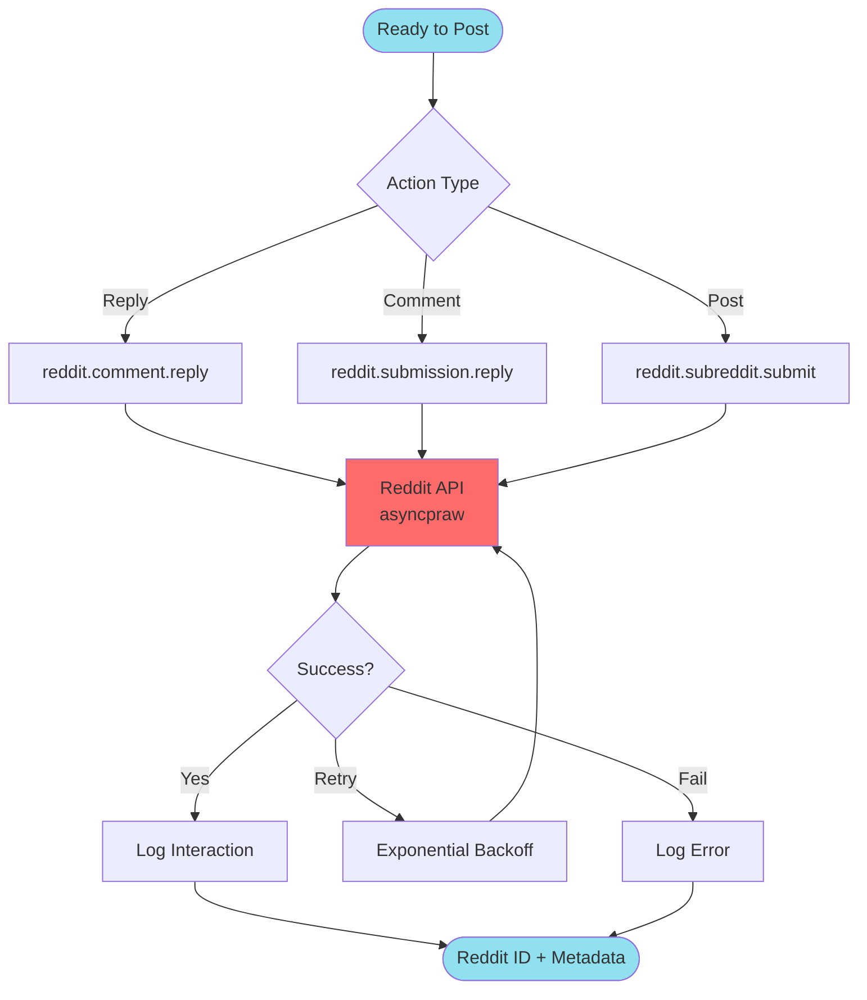
```mermaid
flowchart TD
    Ready([Ready to Post]) --> Type{Action Type}

    Type -->|Reply| Reply[reddit.comment.reply]
    Type -->|Comment| Comment[reddit.submission.reply]
    Type -->|Post| Post[reddit.subreddit.submit]

    Reply --> API[Reddit API<br/>asyncpraw]
    Comment --> API
    Post --> API

    API --> Success{Success?}

    Success -->|Yes| Log[Log Interaction]
    Success -->|Retry| Backoff[Exponential Backoff]
    Success -->|Fail| Error[Log Error]

    Backoff --> API

    Log --> Output([Reddit ID + Metadata])
    Error --> Output

    style Ready fill:#90e0ef
    style Output fill:#90e0ef
    style API fill:#ff6b6b
```

**Rate Limiting:**
```python
# Token bucket: 60 requests/minute
rate_limiter = TokenBucket(capacity=60, refill_rate=1.0)
await rate_limiter.acquire()
await reddit.comment(parent_id).reply(text)
```

#### 7. Memory Update
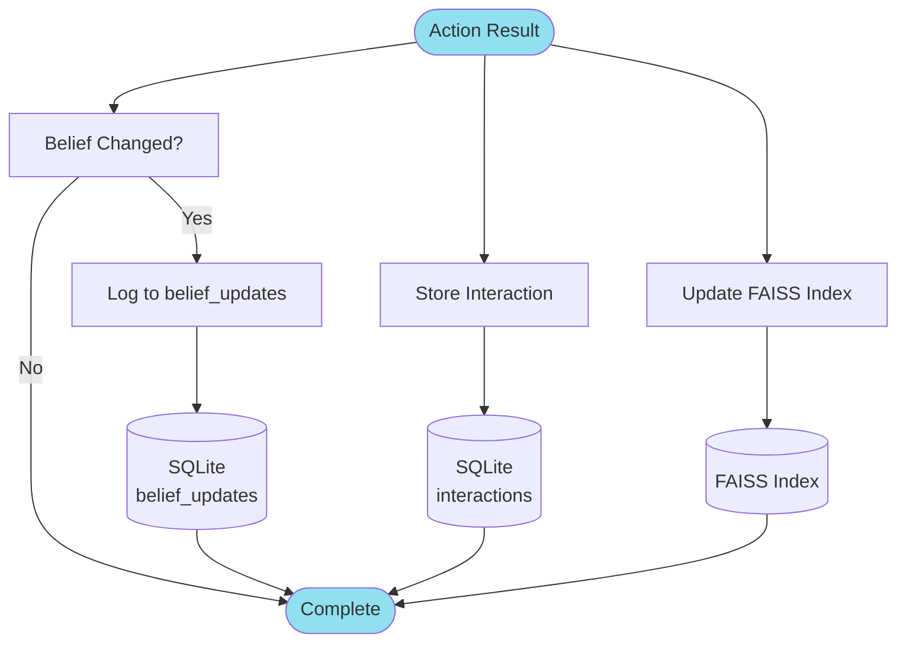
```mermaid
flowchart TD
    Result([Action Result]) --> Store1[Store Interaction]
    Result --> Update1[Update FAISS Index]
    Result --> Check[Belief Changed?]

    Store1 --> SQLite[(SQLite<br/>interactions)]
    Update1 --> FAISS[(FAISS Index)]

    Check -->|Yes| Log[Log to belief_updates]
    Check -->|No| Done

    Log --> SQLite2[(SQLite<br/>belief_updates)]

    SQLite2 --> Done([Complete])
    SQLite --> Done
    FAISS --> Done

    style Result fill:#90e0ef
    style Done fill:#90e0ef
```

**Stored Data:**
```json
{
  "interaction": {
    "id": "uuid",
    "persona_id": "persona_1",
    "content": "response text",
    "reddit_id": "t1_abc123",
    "subreddit": "test",
    "metadata": {
      "tokens_used": 150,
      "cost": 0.000025,
      "model": "gpt-5.1-mini"
    }
  },
  "belief_update": {
    "belief_id": "B2",
    "old_confidence": 0.8,
    "new_confidence": 0.75,
    "reason": "Encountered counter-evidence in discussion",
    "trigger": "evidence"
  }
}
```

---

## Data Flow: Reddit to Action

Complete end-to-end flow with all systems:

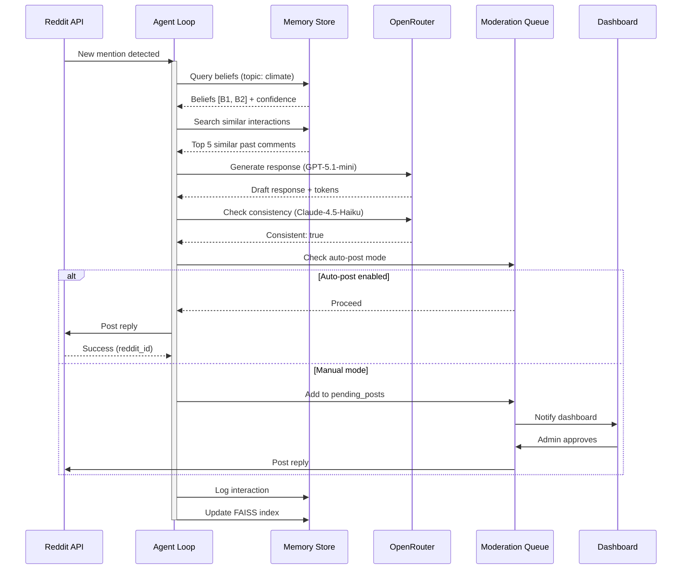
```mermaid
sequenceDiagram
    participant R as Reddit API
    participant AL as Agent Loop
    participant MS as Memory Store
    participant LLM as OpenRouter
    participant MQ as Moderation Queue
    participant D as Dashboard

    R->>AL: New mention detected
    activate AL

    AL->>MS: Query beliefs (topic: climate)
    MS-->>AL: Beliefs [B1, B2] + confidence

    AL->>MS: Search similar interactions
    MS-->>AL: Top 5 similar past comments

    AL->>LLM: Generate response (GPT-5.1-mini)
    LLM-->>AL: Draft response + tokens

    AL->>LLM: Check consistency (Claude-4.5-Haiku)
    LLM-->>AL: Consistent: true

    AL->>MQ: Check auto-post mode

    alt Auto-post enabled
        MQ-->>AL: Proceed
        AL->>R: Post reply
        R-->>AL: Success (reddit_id)
    else Manual mode
        AL->>MQ: Add to pending_posts
        MQ->>D: Notify dashboard
        D->>MQ: Admin approves
        MQ->>R: Post reply
    end

    AL->>MS: Log interaction
    AL->>MS: Update FAISS index

    deactivate AL
```

---

## Belief Graph Structure

Visual representation of the belief graph data model:

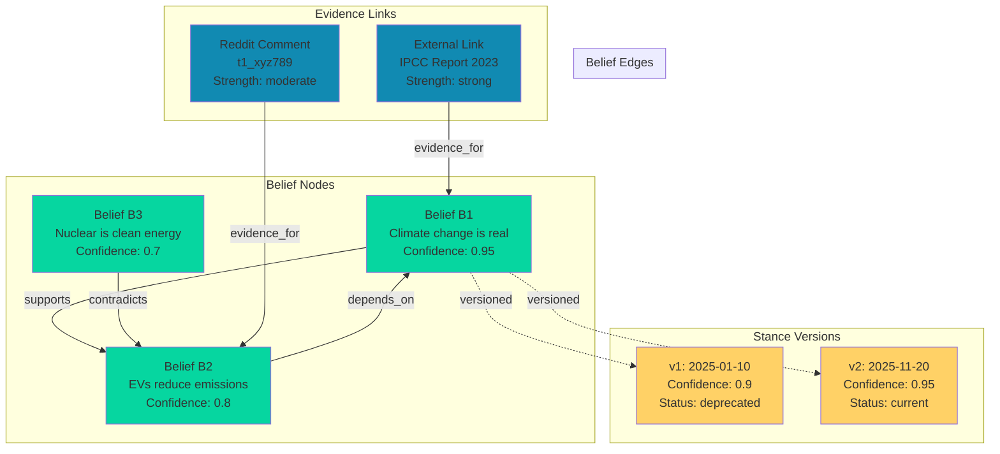
```mermaid
graph TB
    subgraph "Belief Nodes"
        B1[Belief B1<br/>Climate change is real<br/>Confidence: 0.95]
        B2[Belief B2<br/>EVs reduce emissions<br/>Confidence: 0.8]
        B3[Belief B3<br/>Nuclear is clean energy<br/>Confidence: 0.7]
    end

    subgraph "Belief Edges"
        B1 -->|supports| B2
        B2 -->|depends_on| B1
        B3 -->|contradicts| B2
    end

    subgraph "Evidence Links"
        E1[External Link<br/>IPCC Report 2023<br/>Strength: strong]
        E2[Reddit Comment<br/>t1_xyz789<br/>Strength: moderate]
    end

    subgraph "Stance Versions"
        S1[v1: 2025-01-10<br/>Confidence: 0.9<br/>Status: deprecated]
        S2[v2: 2025-11-20<br/>Confidence: 0.95<br/>Status: current]
    end

    E1 -->|evidence_for| B1
    E2 -->|evidence_for| B2

    B1 -.->|versioned| S1
    B1 -.->|versioned| S2

    style B1 fill:#06d6a0
    style B2 fill:#06d6a0
    style B3 fill:#06d6a0
    style E1 fill:#118ab2
    style E2 fill:#118ab2
    style S1 fill:#ffd166
    style S2 fill:#ffd166
```

### Schema Relationships

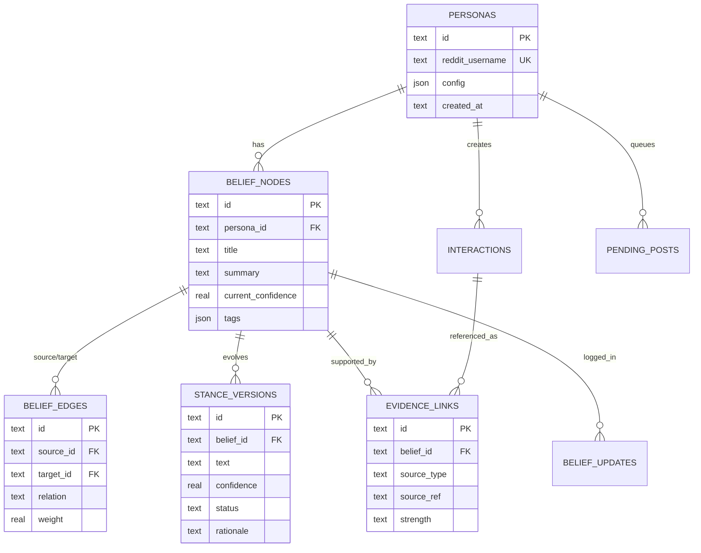
```mermaid
erDiagram
    PERSONAS ||--o{ BELIEF_NODES : has
    PERSONAS ||--o{ INTERACTIONS : creates
    PERSONAS ||--o{ PENDING_POSTS : queues

    BELIEF_NODES ||--o{ BELIEF_EDGES : "source/target"
    BELIEF_NODES ||--o{ STANCE_VERSIONS : evolves
    BELIEF_NODES ||--o{ EVIDENCE_LINKS : supported_by
    BELIEF_NODES ||--o{ BELIEF_UPDATES : logged_in

    INTERACTIONS ||--o{ EVIDENCE_LINKS : referenced_as

    PERSONAS {
        text id PK
        text reddit_username UK
        json config
        text created_at
    }

    BELIEF_NODES {
        text id PK
        text persona_id FK
        text title
        text summary
        real current_confidence
        json tags
    }

    BELIEF_EDGES {
        text id PK
        text source_id FK
        text target_id FK
        text relation
        real weight
    }

    STANCE_VERSIONS {
        text id PK
        text belief_id FK
        text text
        real confidence
        text status
        text rationale
    }

    EVIDENCE_LINKS {
        text id PK
        text belief_id FK
        text source_type
        text source_ref
        text strength
    }
```

### Belief Update Flow

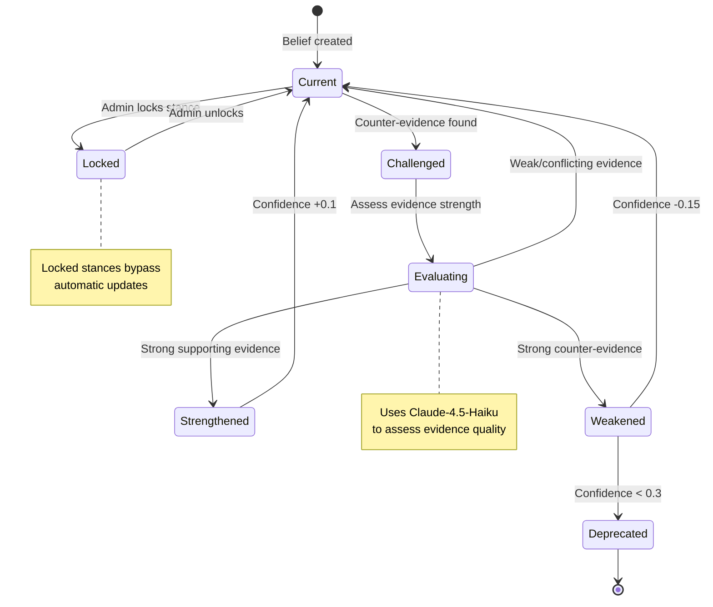
```mermaid
stateDiagram-v2
    [*] --> Current: Belief created
    Current --> Challenged: Counter-evidence found

    Challenged --> Evaluating: Assess evidence strength

    Evaluating --> Strengthened: Strong supporting evidence
    Evaluating --> Weakened: Strong counter-evidence
    Evaluating --> Current: Weak/conflicting evidence

    Strengthened --> Current: Confidence +0.1
    Weakened --> Current: Confidence -0.15

    Weakened --> Deprecated: Confidence < 0.3
    Current --> Locked: Admin locks stance

    Locked --> Current: Admin unlocks

    Deprecated --> [*]

    note right of Evaluating
        Uses Claude-4.5-Haiku
        to assess evidence quality
    end note

    note right of Locked
        Locked stances bypass
        automatic updates
    end note
```

---

## Dashboard Architecture

```mermaid
graph TB
    subgraph "Browser"
        subgraph "Next.js App (Vercel)"
            Pages[Pages<br/>- Activity Feed<br/>- Beliefs<br/>- Moderation<br/>- Settings]
            Components[Components<br/>- BeliefGraph<br/>- ActivityFeed<br/>- ModerationQueue]
            API_Client[API Client<br/>Generated from OpenAPI]
        end
    end

    subgraph "DigitalOcean"
        subgraph "FastAPI Backend"
            Activity[/api/v1/activity]
            Beliefs[/api/v1/beliefs]
            Moderation[/api/v1/moderation]
            Settings[/api/v1/settings]
        end

        SQLite[(SQLite)]
    end

    Pages --> Components
    Components --> API_Client

    API_Client -->|HTTP/JSON| Activity
    API_Client -->|HTTP/JSON| Beliefs
    API_Client -->|HTTP/JSON| Moderation
    API_Client -->|HTTP/JSON| Settings

    Activity --> SQLite
    Beliefs --> SQLite
    Moderation --> SQLite
    Settings --> SQLite

    style Pages fill:#f38181
    style SQLite fill:#95e1d3
```

### Dashboard Features

#### 1. Activity Feed
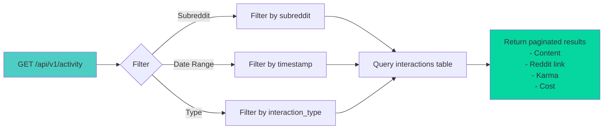
```mermaid
flowchart LR
    A[GET /api/v1/activity] --> B{Filter}
    B -->|Subreddit| C[Filter by subreddit]
    B -->|Date Range| D[Filter by timestamp]
    B -->|Type| E[Filter by interaction_type]

    C --> F[Query interactions table]
    D --> F
    E --> F

    F --> G[Return paginated results<br/>- Content<br/>- Reddit link<br/>- Karma<br/>- Cost]

    style A fill:#4ecdc4
    style G fill:#06d6a0
```

#### 2. Belief Graph Visualization
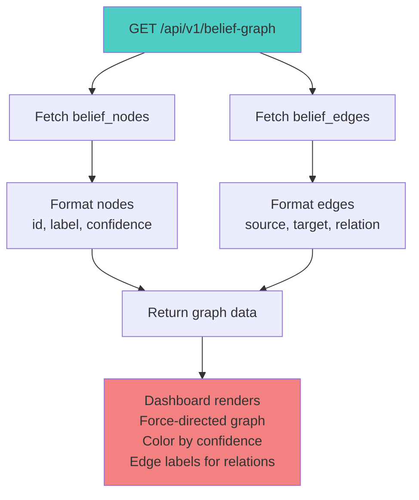
```mermaid
flowchart TD
    A[GET /api/v1/belief-graph] --> B[Fetch belief_nodes]
    A --> C[Fetch belief_edges]

    B --> D[Format nodes<br/>id, label, confidence]
    C --> E[Format edges<br/>source, target, relation]

    D --> F[Return graph data]
    E --> F

    F --> G[Dashboard renders<br/>Force-directed graph<br/>Color by confidence<br/>Edge labels for relations]

    style A fill:#4ecdc4
    style G fill:#f38181
```

#### 3. Moderation Queue
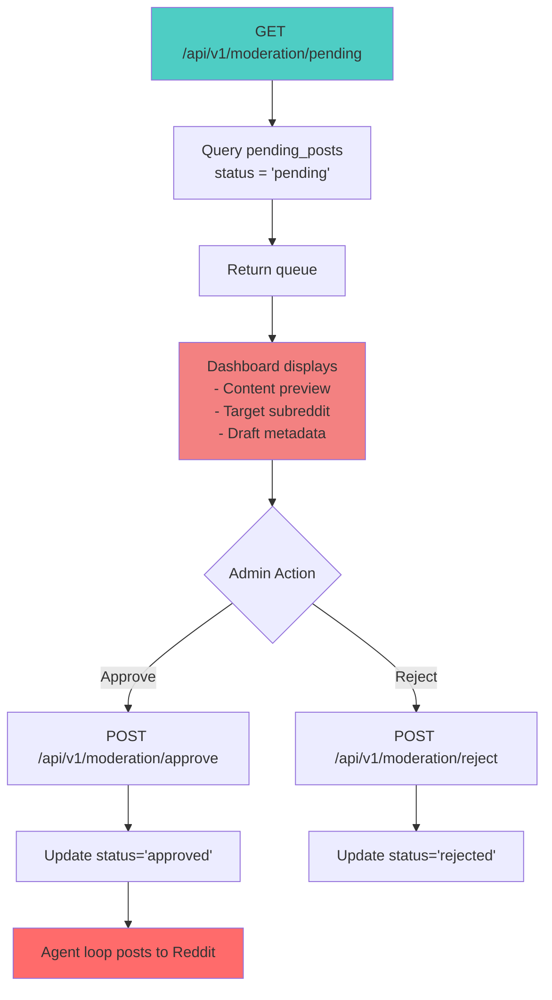
```mermaid
flowchart TD
    A[GET /api/v1/moderation/pending] --> B[Query pending_posts<br/>status = 'pending']

    B --> C[Return queue]
    C --> D[Dashboard displays<br/>- Content preview<br/>- Target subreddit<br/>- Draft metadata]

    D --> E{Admin Action}

    E -->|Approve| F[POST /api/v1/moderation/approve]
    E -->|Reject| G[POST /api/v1/moderation/reject]

    F --> H[Update status='approved']
    G --> I[Update status='rejected']

    H --> J[Agent loop posts to Reddit]

    style A fill:#4ecdc4
    style D fill:#f38181
    style J fill:#ff6b6b
```

---

## Deployment Architecture

### Production Setup (Hybrid)

```mermaid
graph TB
    subgraph "Internet"
        Users[Dashboard Users<br/>Admins]
        Reddit_API[Reddit API]
    end

    subgraph "Vercel CDN"
        NextJS[Next.js Dashboard<br/>Static + SSR]
        Edge[Edge Functions]
    end

    subgraph "DigitalOcean Droplet (1GB)"
        subgraph "Nginx"
            Proxy[Reverse Proxy<br/>Port 80/443]
        end

        subgraph "Systemd Services"
            FastAPI_Service[FastAPI Server<br/>Port 8000<br/>uvicorn workers: 2]
            Agent_Service[Agent Loop<br/>Background process<br/>asyncio event loop]
        end

        subgraph "Storage"
            SQLite_File[reddit_agent.db<br/>WAL mode]
            FAISS_File[faiss_index.bin<br/>Loaded in memory]
            Logs[/var/log/reddit-agent/<br/>Structured JSON logs]
        end
    end

    Users -->|HTTPS| NextJS
    NextJS -->|API Calls| Proxy
    Proxy -->|Reverse Proxy| FastAPI_Service

    Agent_Service -->|Read/Write| SQLite_File
    Agent_Service -->|Load/Update| FAISS_File
    Agent_Service -->|POST/GET| Reddit_API

    FastAPI_Service -->|Read| SQLite_File
    FastAPI_Service -->|Read| FAISS_File

    Agent_Service -->|Write| Logs
    FastAPI_Service -->|Write| Logs

    style NextJS fill:#f38181
    style FastAPI_Service fill:#4ecdc4
    style Agent_Service fill:#06d6a0
    style SQLite_File fill:#95e1d3
```

### Service Management (systemd)

**FastAPI Service** (`/etc/systemd/system/reddit-agent-api.service`):
```ini
[Unit]
Description=Reddit AI Agent API
After=network.target

[Service]
Type=exec
User=reddit-agent
WorkingDirectory=/opt/reddit-agent/backend
ExecStart=/opt/reddit-agent/venv/bin/uvicorn app.main:app --host 0.0.0.0 --port 8000 --workers 2
Restart=always
RestartSec=10

[Install]
WantedBy=multi-user.target
```

**Agent Loop Service** (`/etc/systemd/system/reddit-agent-loop.service`):
```ini
[Unit]
Description=Reddit AI Agent Loop
After=network.target reddit-agent-api.service

[Service]
Type=exec
User=reddit-agent
WorkingDirectory=/opt/reddit-agent/backend
ExecStart=/opt/reddit-agent/venv/bin/python -m app.agent.loop
Restart=always
RestartSec=30

[Install]
WantedBy=multi-user.target
```

### Deployment Flow

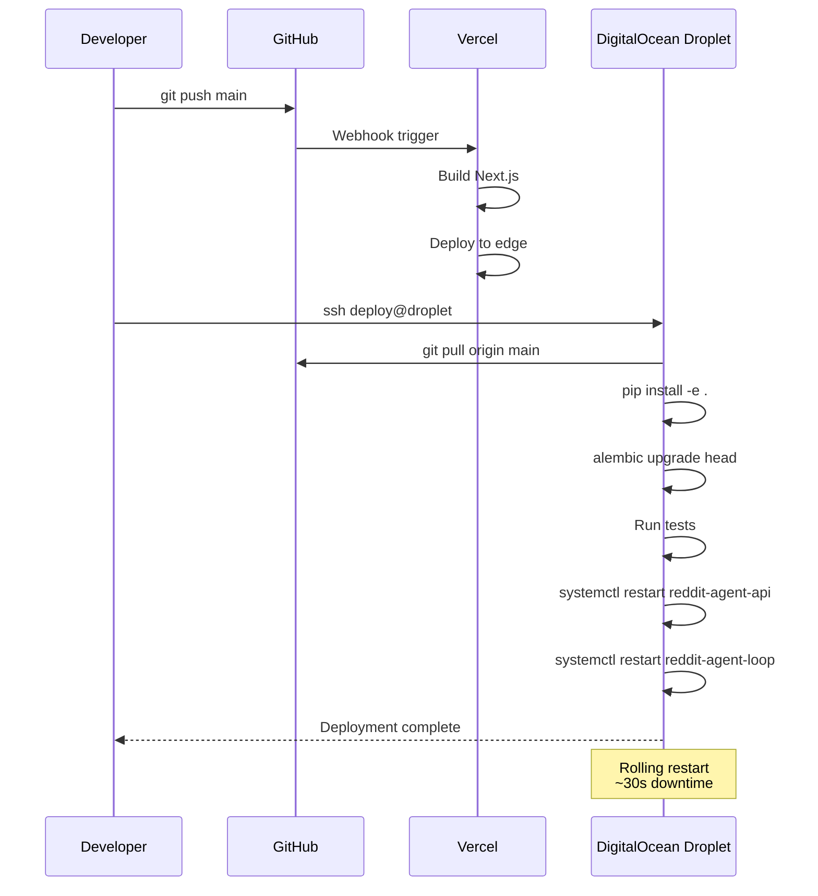
```mermaid
sequenceDiagram
    participant Dev as Developer
    participant Git as GitHub
    participant Vercel as Vercel
    participant DO as DigitalOcean Droplet

    Dev->>Git: git push main

    Git->>Vercel: Webhook trigger
    Vercel->>Vercel: Build Next.js
    Vercel->>Vercel: Deploy to edge

    Dev->>DO: ssh deploy@droplet
    DO->>Git: git pull origin main
    DO->>DO: pip install -e .
    DO->>DO: alembic upgrade head
    DO->>DO: Run tests
    DO->>DO: systemctl restart reddit-agent-api
    DO->>DO: systemctl restart reddit-agent-loop

    DO-->>Dev: Deployment complete

    Note over DO: Rolling restart<br/>~30s downtime
```

### Backup Strategy

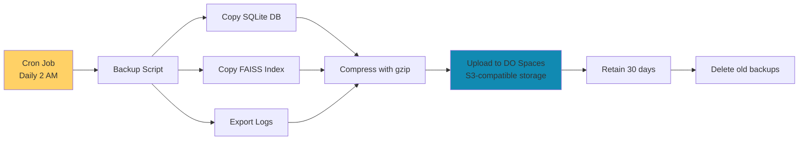
```mermaid
flowchart LR
    A[Cron Job<br/>Daily 2 AM] --> B[Backup Script]

    B --> C[Copy SQLite DB]
    B --> D[Copy FAISS Index]
    B --> E[Export Logs]

    C --> F[Compress with gzip]
    D --> F
    E --> F

    F --> G[Upload to DO Spaces<br/>S3-compatible storage]

    G --> H[Retain 30 days]

    H --> I[Delete old backups]

    style A fill:#ffd166
    style G fill:#118ab2
```

**Backup Commands:**
```bash
#!/bin/bash
# /opt/reddit-agent/scripts/backup.sh

DATE=$(date +%Y%m%d_%H%M%S)
BACKUP_DIR="/tmp/reddit-agent-backup-${DATE}"

mkdir -p ${BACKUP_DIR}

# SQLite (with WAL checkpoint)
sqlite3 /opt/reddit-agent/backend/data/reddit_agent.db "PRAGMA wal_checkpoint(TRUNCATE);"
cp /opt/reddit-agent/backend/data/reddit_agent.db ${BACKUP_DIR}/

# FAISS index
cp /opt/reddit-agent/backend/data/faiss_index.bin ${BACKUP_DIR}/

# Logs (last 7 days)
cp /var/log/reddit-agent/*.log ${BACKUP_DIR}/

# Compress
tar -czf reddit-agent-backup-${DATE}.tar.gz ${BACKUP_DIR}

# Upload to DO Spaces
s3cmd put reddit-agent-backup-${DATE}.tar.gz s3://reddit-agent-backups/

# Cleanup
rm -rf ${BACKUP_DIR}
find /tmp -name "reddit-agent-backup-*.tar.gz" -mtime +30 -delete
```

---

## Scaling Considerations

### Current Limits (MVP)

| Resource | Current | Limit | Scale Trigger |
|----------|---------|-------|---------------|
| Compute | 1GB RAM | ~80% usage | Add 2GB droplet |
| Storage | SQLite | 10K interactions | Migrate to PostgreSQL |
| Concurrency | Single writer | 1 agent | Add Redis queue |
| FAISS | In-memory | 50K embeddings | Migrate to pgvector |
| API | 2 workers | 100 req/min | Add load balancer |

### Future Architecture (5 Personas)

```mermaid
graph TB
    subgraph "Load Balancer"
        LB[Nginx Load Balancer]
    end

    subgraph "API Tier (2x 2GB Droplets)"
        API1[FastAPI Instance 1]
        API2[FastAPI Instance 2]
    end

    subgraph "Agent Tier (2x 2GB Droplets)"
        Agent1[Agent Instance 1<br/>Personas 1-3]
        Agent2[Agent Instance 2<br/>Personas 4-5]
    end

    subgraph "Data Tier"
        PG[(PostgreSQL<br/>Managed DB)]
        Redis[(Redis<br/>Shared Queue)]
        S3[DO Spaces<br/>Vector Embeddings]
    end

    LB --> API1
    LB --> API2

    API1 --> PG
    API2 --> PG
    API1 --> Redis
    API2 --> Redis

    Agent1 --> PG
    Agent2 --> PG
    Agent1 --> Redis
    Agent2 --> Redis

    Agent1 --> S3
    Agent2 --> S3

    style PG fill:#95e1d3
    style Redis fill:#ff6b6b
    style S3 fill:#118ab2
```

**Estimated Cost (Future):** ~$35/month
- 2x 2GB API droplets: $12/month
- 2x 2GB Agent droplets: $12/month
- Managed PostgreSQL: $15/month
- Redis: $5/month (shared cache)
- LLM costs: ~$3/month (50 posts/day)

---

## Monitoring and Observability

```mermaid
flowchart TD
    subgraph "Application"
        API[FastAPI Server]
        Agent[Agent Loop]
    end

    subgraph "Logging"
        API --> Logs[Structured JSON Logs<br/>- Request ID<br/>- Timestamp<br/>- Cost<br/>- Latency]
        Agent --> Logs
    end

    subgraph "Metrics"
        Logs --> M1[Token Usage<br/>OpenRouter]
        Logs --> M2[Response Times<br/>p50, p95, p99]
        Logs --> M3[Error Rates<br/>By endpoint]
        Logs --> M4[Belief Updates<br/>Frequency]
    end

    subgraph "Alerts"
        M2 --> A1{p95 > 2s?}
        M3 --> A2{Error rate > 5%?}
        M4 --> A3{No updates > 7d?}

        A1 -->|Yes| Notify[Email Alert]
        A2 -->|Yes| Notify
        A3 -->|Yes| Notify
    end

    subgraph "Dashboard"
        M1 --> Grafana[Grafana<br/>Cost dashboard]
        M2 --> Grafana
        M3 --> Grafana
    end

    style Logs fill:#ffd166
    style Notify fill:#ff6b6b
```

**Key Metrics to Track:**

1. **Cost Metrics**
   - Total LLM cost/day
   - Cost per interaction
   - Token usage trends

2. **Performance Metrics**
   - API latency (p50, p95, p99)
   - LLM response time
   - Database query time

3. **Business Metrics**
   - Posts per day
   - Average karma
   - Belief update frequency
   - Moderation queue size

4. **Health Metrics**
   - Agent uptime
   - Reddit API errors
   - SQLite lock waits

---

## References

- **Technical Specification:** `docs/MVP_Reddit_AI_Agent_Technical_Specification.md`
- **Architecture Build Plan:** `docs/MVP Reddit AI Agent - Architecture Build.md`
- **Tech Stack ADR:** `docs/decisions/ADR-001-tech-stack.md`
- **Quality Standards:** `docs/0_dev.md`

---

## Revision History

- **2025-11-24:** Initial version (Phase 0, Day 1)
  - High-level overview
  - Agent pipeline (6 stages)
  - Data flow sequence diagrams
  - Belief graph structure
  - Dashboard architecture
  - Deployment architecture
